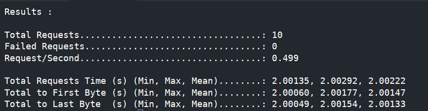

# feedback

HTTP load testing CLI — hit one or more endpoints concurrently and get 
latency breakdowns including Time to First Byte (TTFB) and Time to Last 
Byte (TTLB), measured at the transport layer via Go's httptrace.

## Install

git clone https://github.com/aryansaves/Feedback
cd Feedback
go build -o feedback .

## Usage

Single URL:
./feedback -u http://localhost:3000/test -n 100 -c 10

Multiple URLs from file (round-robin):
./feedback -f urls.txt -n 100 -c 10

## Flags

-u    target URL
-f    file with one URL per line
-n    total requests (default 10)
-c    concurrent workers (default 5, must be <= n)

## Output

